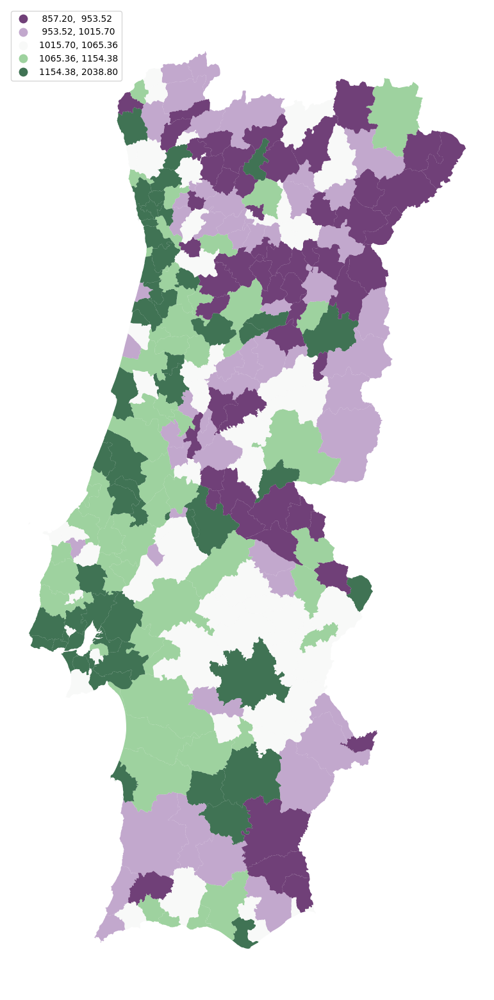

# Spatial Analysis of Portuguese Income using Moran's I

# Overview:
Income inequality and regional disparities are crucial issues that have significant 
socio-economic implications. This Python project leverages spatial data analysis 
techniques and the PySAL library to investigate and visualize income disparities 
across different regions in Portugal. The project aims to provide valuable insights 
into the spatial distribution of income and identify potential areas for targeted policy 
interventions.

## Technical objective:
Identify clusters of income disparity within Portuguese regions using Moran's I,a 
spatial autocorrelation statistic, which will help us uncover spatial patterns. 

## Data Source:
Data on income was gathered from PORDATA, a database for Portuguese statistics.

Geojson of Portuguese parishes came from @nmota

## Exploratory Spatial Data Analysis:
We start by conducting an EDA to gain insights into the 
income data distribution and its spatial characteristics.
So we created a choropleth map to visualize income disparities across Portugal.

## Statistical Computations:
- **Moran's I** 
a spatial autocorrelation statistic used to measure the degree of spatial clustering 
or dispersion of a variable (in this case, income).
- **Local Indicators of Spatial Autocorrelation (LISA)** Cluster Analysis 
LISA is an extension of Moran's I that provides insights into local patterns of spatial 
autocorrelation.
LISA can categorize regions as High-High (hotspots), Low-Low (cold spots), High-Low 
(outliers), or Low-High (outliers).

## Conclusions:
From the map generated using LISA clusters, it becomes evident that income hotspots are 
concentrated in the Lisbon and Oporto regions, along with Alentejo, whereas the cold 
spots are notably found in Trás-os-Montes. Interestingly, when we initially examined the 
choropleth map, it was challenging to visually discern these clusters.
 
This observation underscores the importance of tailoring income distribution policies with 
a specific emphasis on addressing the identified cold spots. Furthermore, it highlights the 
advantage of implementing such policies within homogeneous regions rather than attempting to 
apply them uniformly across the entire country.

## Future Work:
- Consider extending the analysis to include additional socioeconomic variables to gain a 
more holistic understanding of regional disparities.
- Explore advanced spatial analysis techniques, such as spatial regression, to 
investigate the factors contributing to income disparities.

